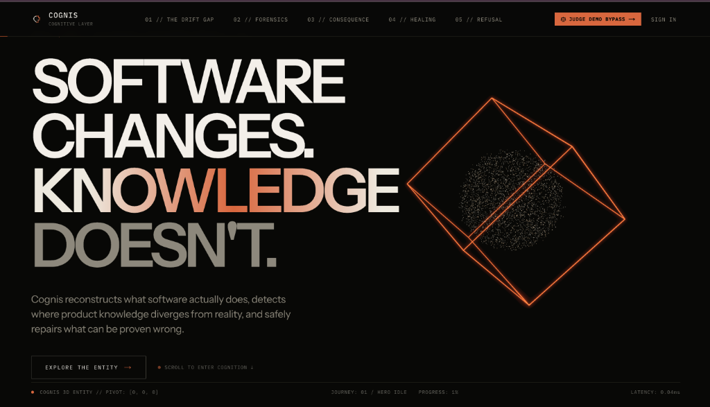
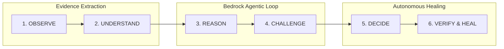
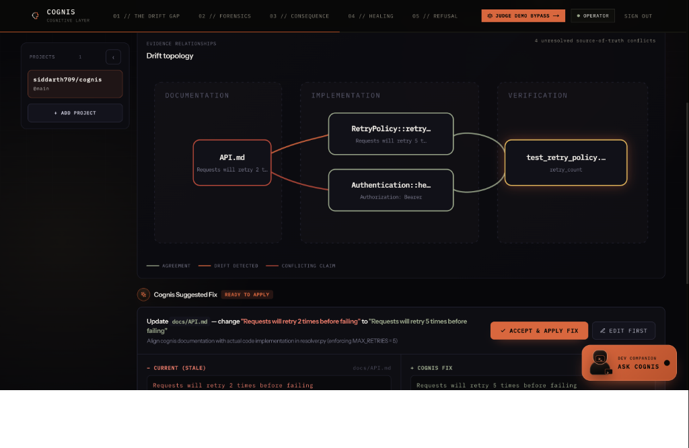
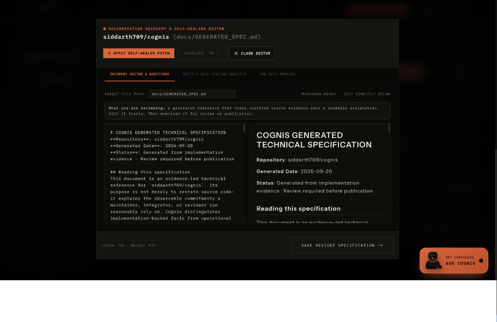
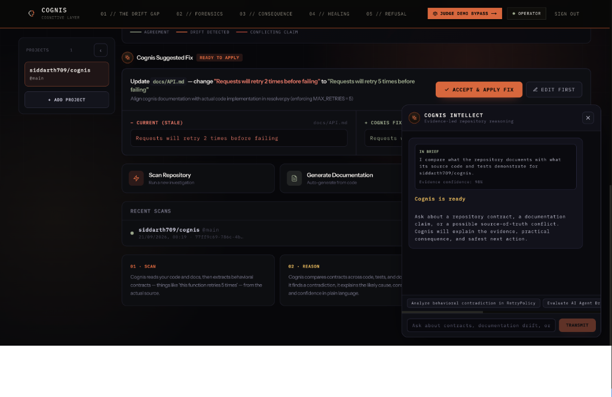

# Cognis

> **Autonomous Behavioral Verification & Self-Healing Cognitive Layer for Codebases**  
> *"Software changes. Knowledge doesn't."*

[](infra/aws/)
[](https://aws.amazon.com/bedrock/)
[](apps/web/)
[](backend/)
[](infra/aws/template.yaml)
[](LICENSE)

---



---

## Table of Contents

- [Overview: What is Cognis?](#overview-what-is-cognis)
- [The Core Problem: The Knowledge Drift Gap](#the-core-problem-the-knowledge-drift-gap)
- [How Cognis Works: The 6-Stage Cognitive Loop](#how-cognis-works-the-6-stage-cognitive-loop)
- [AWS Cloud Architecture & Serverless Pipeline](#aws-cloud-architecture--serverless-pipeline)
- [Repository & Monorepo Architecture](#repository--monorepo-architecture)
- [Interactive Features & Visual Experience](#interactive-features--visual-experience)
- [Where Cognis Stands Out from Existing Tools](#where-cognis-stands-out-from-existing-tools)
- [Key Engineering Challenges & Solutions](#key-engineering-challenges--solutions)
- [Getting Started & Local Development](#getting-started--local-development)
- [AWS Deployment Guide](#aws-deployment-guide)

---

## Overview: What is Cognis?

**Cognis** is an autonomous behavioral verification engine and cognitive layer built for complex, fast-moving codebases.

In modern software development, code changes at breakneck speed through continuous integration, refactoring, and AI-assisted coding tools. However, the **knowledge** surrounding that software—architectural specs, README documentation, API contracts, retry logic, timeout definitions, and operational assumptions—rarely keeps pace. 

Over time, this creates a dangerous divergence: **The Drift Gap**.

Cognis closes this gap by:
1. Reconstructing what software **actually does** using Abstract Syntax Tree (AST) parsing, test suite introspection, and schema analysis.
2. Formulating **behavioral contracts** across code, documentation, and verification suites.
3. Challenging contradictions in an isolated sandbox powered by **Amazon Bedrock**.
4. Safely **self-healing** stale documentation and mismatched contracts using an immutable rollback ledger (`HealTransaction`) and immune memory regression checks.
5. Publishing verified, live documentation through a cryptographically gated **Amazon CloudFront + S3** distribution.

---

## The Core Problem: The Knowledge Drift Gap

Most software failures and developer onboarding friction are not caused by syntactic bugs—linters and type-checkers already catch those. They are caused by **semantic divergence**:

```text
┌─────────────────────────────────────────────────────────────┐
│                    THE DRIFT GAP                            │
├──────────────────────────────┬──────────────────────────────┤
│ What the Docs Claim:         │ "Requests retry 2 times       │
│                              │  before throwing an error."  │
├──────────────────────────────┼──────────────────────────────┤
│ What the Code Actually Does: │ MAX_RETRIES = 5              │
│                              │ (Silent rate-limit cascade!) │
├──────────────────────────────┼──────────────────────────────┤
│ What the Unit Test Asserts:  │ assert retry_count == 2      │
│                              │ (Outdated, mocked pass!)     │
└──────────────────────────────┴──────────────────────────────┘
```

When an incident occurs, engineers follow the outdated documentation. When an AI coding agent is tasked with writing a feature, it hallucinates against stale specifications.

**Cognis makes codebases self-aware, self-verifying, and self-healing.**

---

## How Cognis Works: The 6-Stage Cognitive Loop

Cognis executes an end-to-end autonomous reasoning pipeline coordinated by [`backend/orchestrator.py`](backend/orchestrator.py):



### 1. Observe
Ingests the target repository surface across multiple languages and file types (`.py`, `.ts`, `.tsx`, `.js`, `.go`, `.java`, `.md`, `.rst`). Downloads and isolates clean git tree snapshots.

### 2. Understand (Evidence Graph Construction)
[`backend/evidence/pipeline.py`](backend/evidence/pipeline.py) builds a multi-surface **Evidence Graph**. It extracts AST symbols, docstring claims, markdown assertions, and test harness mocks into discrete evidence nodes.

### 3. Reason (Contract Resolution)
[`backend/contracts/`](backend/contracts/) extracts explicit behavioral contracts (such as `RetryPolicy`, authentication headers, error boundaries, rate limits, and data serialization formats) and pairs them against documentation assertions, flagging contradictions with severity and confidence scores.

### 4. Challenge (Adversarial Agent Loop)
Using **Amazon Bedrock** (`anthropic.claude-sonnet-4-6`), Cognis spawns an investigation loop. It generates hypotheses about whether the code, the test, or the documentation represents the intended ground truth, executing sandbox tests via [`SubprocessSandboxRunner`](backend/agent/tools.py) to validate assumptions.

### 5. Decide (Confidence-Gated Autonomy Dial)
Cognis compares the resolution confidence against a user-configurable **Autonomy Threshold** (default: `0.75`). Actions exceeding the threshold can be applied automatically; ambiguous cases are escalated to human operators.

### 6. Verify & Heal
When a fix is confirmed, [`backend/healing/`](backend/healing/) opens a transactional change record (`HealTransaction`), applies surgical patches, executes **Immune Memory** regression checks, and commits the resolution.

---

## AWS Cloud Architecture & Serverless Pipeline

The AWS infrastructure in [`infra/aws/`](infra/aws/) delivers an enterprise-grade, serverless execution environment capable of handling repository-scale AST parsing and agentic reasoning without server maintenance:

```text
┌─────────────────────────────────────────────────────────────────────────────────┐
│                           COGNIS AWS CLOUD TOPOLOGY                             │
└─────────────────────────────────────────────────────────────────────────────────┘

    Next.js Dashboard / GitHub Webhooks
                  │
                  ▼ (HTTPS / API Key Authorized)
       ┌──────────────────────┐
       │   Amazon API Gateway │  (HTTP API /v1/investigations)
       └──────────┬───────────┘
                  │
                  ▼
       ┌──────────────────────┐
       │ Ingress Lambda (arm64│  Creates record in DynamoDB,
       └──────────┬───────────┘  triggers Step Functions
                  │
                  ▼
 ┏━━━━━━━━━━━━━━━━━━━━━━━━━━━━━━━━━━━━━━━━━━━━━━━━━━━━━━━━━━━━━━━━━━━━━━━━━━━━━┓
 ┃                      AWS STEP FUNCTIONS STATE MACHINE                       ┃
 ┃                                                                             ┃
 ┃   ┌────────────────────────┐                                                ┃
 ┃   │    ObserveFunction     │ ──> Downloads repo archive, saves to S3        ┃
 ┃   └───────────┬────────────┘                                                ┃
 ┃               │                                                             ┃
 ┃               ▼                                                             ┃
 ┃   ┌────────────────────────┐                                                ┃
 ┃   │     EngineFunction     │ <── Containerized Lambda (Docker on ARM64)     ┃
 ┃   │  (2GB RAM, 10GB /tmp)  │ <── Invokes Amazon Bedrock Claude Sonnet       ┃
 ┃   └───────────┬────────────┘ ──> Runs AST parser, sandbox & contracts       ┃
 ┃               │                                                             ┃
 ┃               ▼                                                             ┃
 ┃   ┌────────────────────────┐                                                ┃
 ┃   │    PersistFunction     │ ──> Stores graph & contracts in DynamoDB       ┃
 ┃   └───────────┬────────────┘ ──> Validates publication gate                 ┃
 ┃               │                                                             ┃
 ┃               ▼                                                             ┃
 ┃   ┌────────────────────────┐                                                ┃
 ┃   │    RecordFailure       │ (Dead-letter execution handler on failure)     ┃
 ┃   └────────────────────────┘                                                ┃
 ┗━━━━━━━━━━━━━━━┯━━━━━━━━━━━━━━━━━━━━━━━━━━━━━━━━━━━━━━━━━━━━━━━━━━━━━━━━━━━━━┛
                 │
                 ├─────────────────────────────────┐
                 ▼                                 ▼
   ┌───────────────────────────┐     ┌───────────────────────────┐
   │    Amazon DynamoDB Tables │     │     Amazon S3 Buckets     │
   │  - InvestigationsTable    │     │  - ArtifactBucket (14-day │
   │  - ContractsTable         │     │    lifecycle expiration)  │
   │  - EvidenceTable          │     │  - PublishedDocsBucket    │
   │  - InvestigationTraceTable│     │    (Versioned, AES256)    │
   │  - DriftLedgerTable       │     └─────────────┬─────────────┘
   │  - PublishedDocumentsTable│                   │
   └───────────────────────────┘                   ▼ (Origin Access Control)
                                     ┌───────────────────────────┐
                                     │     Amazon CloudFront     │
                                     │ (Public Live Docs Gateway)│
                                     └───────────────────────────┘
```

### Key Infrastructure Highlights:
1. **Containerized Engine on ARM64 Graviton**: The core engine runs as a container image packaged Lambda function with 2,048 MB memory and 10 GB ephemeral `/tmp` storage, enabling full AST tree compilation and repository unpacking.
2. **Standard Step Functions Pipeline**: State transitions (`Observe` to `Engine` to `Persist`) feature automatic retry with exponential backoff and centralized dead-letter error handling.
3. **Dual S3 Isolation & Origin Access Control (OAC)**:
   - `ArtifactBucket`: Ephemeral bucket holding temporary zip archives and intermediate scan results, governed by a 14-day lifecycle policy.
   - `PublishedDocsBucket`: Strictly private S3 bucket with versioning and AES256 encryption. Only CloudFront with SigV4 Origin Access Control can read published documentation.
4. **Publication Verification Gate**: `PersistFunction` will only push generated reference documentation to the public CloudFront distribution if every candidate transaction is verified or patched with zero unresolved rejections.
5. **Real-time Status Streaming**: Dedicated `cognis-http-status` Lambda polls DynamoDB and S3 to provide real-time updates to the web dashboard.

---

## Repository & Monorepo Architecture

The Cognis monorepo maintains strict isolation between user-facing presentation, Python core verification logic, and cloud infrastructure:

```text
cognis/
├── apps/
│   └── web/
├── backend/
│   ├── agent/
│   ├── contracts/
│   ├── evidence/
│   ├── healing/
│   ├── lambda_handlers/
│   ├── orchestrator.py
│   └── requirements.txt
├── infra/
│   └── aws/
│       ├── template.yaml
│       ├── statemachine/
│       ├── functions/
│       └── scripts/
└── docs/
    └── images/
```

- **`apps/web/`**: Next.js 15 App Router frontend, React 19, interactive Three.js 3D particle entity, dynamic drift graph visualization, self-healing Markdown split editor, and Cognis Intellect dev companion drawer.
- **`backend/`**: Python 3.12 core verification engine including AST extractors, retry contract parsers, Bedrock client, tool registry, sandbox runner, `HealTransaction` ledger, diff patch generator, and immune memory regression checking.
- **`infra/aws/`**: Cloud infrastructure containing SAM template, Step Functions ASL definitions, containerized Lambda handlers, DynamoDB schemas, and CloudFront OAC distribution configs.
- **`docs/`**: Architecture specs, drift sentinel notes, and UI image assets.

---

## Interactive Features & Visual Experience

### 1. Evidence Relationships & Drift Topology
Cognis renders a visual tri-party graph mapping relationships between **Documentation**, **Implementation**, and **Verification**. When behavior contradicts claims, edges turn red and a surgical diff patch is generated automatically.



### 2. Documentation Recovery & Self-Healing Split Editor
Review and edit auto-healed technical specifications side-by-side with live markdown rendering. Maintainers can approve patches directly or trigger a single-click commit back to GitHub.



### 3. Cognis Intellect: Evidence-Led Developer Companion
An interactive repository reasoning panel grounded in verified AST evidence. Ask natural-language questions about retry policies, behavioral divergence, or AI agent drift, and receive answers backed by cryptographic source citations.



---

## Where Cognis Stands Out from Existing Tools

| Dimension | Linters & Static Analysis (SonarQube, ESLint) | AI Coding Copilots (GitHub Copilot, Cursor) | Doc Generators (Sphinx, Swagger, TypeDoc) | **Cognis** |
|:---|:---|:---|:---|:---|
| **Semantic Scope** | Syntax, style, type definitions | Code completion, local prompt generation | Comment scraping, type signature dumps | **Tri-party behavioral truth arbitration** |
| **Documentation Awareness** | None; ignores prose and markdown | Reads docs as prompt context; cannot verify accuracy | Assumes comments are truthful | **Detects contradictions between docs and ASTs** |
| **Ground Truth Arbitration** | Fails if code has syntax errors | Biased toward prompt instructions | None | **Adversarial Bedrock reasoning loop in a sandbox** |
| **Healing Safety** | Automated autofixes (whitespace/rules) | Unchecked inline generation | Read-only | **Atomic `HealTransaction` with rollback & Immune Memory** |
| **Live Docs Gate** | None | None | Overwrites indiscriminately | **Cryptographic CloudFront publication gate** |
| **Interactive Reasoning** | None | Generic LLM chat (prone to hallucinations) | None | **Evidence-grounded Intellect Copilot** |

---

## Key Engineering Challenges & Solutions

### 1. Tri-Party Ground Truth Arbitration
* **Challenge**: In real-world legacy codebases, which source represents reality? Code has bugs; documentation is outdated; tests frequently pass with mocked, obsolete assertions.
* **Solution**: Developed a tri-party evidence graph ([`backend/evidence/graph.py`](backend/evidence/graph.py)) that connects Documentation Claims, Implementation ASTs, and Test Assertions. When a contradiction arises, an adversarial Bedrock agent runs sandbox tests to identify which component diverged from expected behavioral invariants.

### 2. Packaging Heavy Python Runtimes into Serverless Lambda
* **Challenge**: AST parsers, tree-sitter bindings, language tools, and the AWS Bedrock SDK easily breach standard 250MB zip deployment limits and default Lambda memory caps.
* **Solution**: Built containerized Lambda images deployed on **AWS Graviton (ARM64)** with 2,048 MB RAM and 10 GB ephemeral `/tmp` storage, keeping the Python core completely decoupled from the cloud wrapper.

### 3. Preventing Hallucinated Autofixes
* **Challenge**: Autonomous LLM patching can introduce regressions or break subtle edge cases.
* **Solution**: Implemented an immutable transaction ledger ([`backend/healing/transaction.py`](backend/healing/transaction.py)) combined with an **Immune Memory** engine ([`backend/healing/immune_memory.py`](backend/healing/immune_memory.py)). Before any patch can be accepted, sandbox regression tests run against modified code to ensure invariants remain intact.

### 4. Eliminating Stale Dashboard Race Conditions
* **Challenge**: When kicking off an asynchronous Step Functions investigation from the Next.js frontend, immediate polling caused UI flicker and empty states before DynamoDB indexed the new run.
* **Solution**: Implemented optimistic state caching on the client with synchronized status reconciliation, preserving running scan cards smoothly across initial re-renders.

### 5. Seamless CloudFront Account Verification Fallback
* **Challenge**: New AWS accounts frequently experience provisioning holds or delayed verification when creating global CloudFront distributions.
* **Solution**: Engineered a conditional deployment toggle (`EnableCloudFront=false`) in the SAM template. Cognis stores and indexes verified documents in encrypted private S3 and DynamoDB immediately, allowing CloudFront to be activated with a single parameter update once account verification completes.

---

## Getting Started & Local Development

### Prerequisites
- Node.js 20+ and `pnpm`
- Python 3.12+ and `pip`
- AWS CLI & AWS SAM CLI
- Docker

### 1. Clone & Install Workspace

```bash
git clone https://github.com/siddarth1709/cognis.git
cd cognis
pnpm install
cd backend
python -m pip install -r requirements.txt
cd ..
```

### 2. Run the Next.js Frontend

```bash
pnpm dev
```

### 3. Run Backend Verification Locally

```bash
python backend/local_investigation.py --repo . --threshold 0.75
```

---

## AWS Deployment Guide

```bash
cd infra/aws
sam validate --lint
sam build
sam deploy --guided
```

### Configuration Parameters:
- `CognisModelId`: Bedrock model ID (default: `anthropic.claude-sonnet-4-6`).
- `CognisApiKey`: Server-to-server API secret (minimum 32 characters) passed to Next.js.
- `CognisAutonomyThreshold`: Confidence threshold for autonomous healing (default: `0.75`).
- `EnableCloudFront`: Set to `true` once CloudFront is enabled in your AWS account.

---

## License

Cognis is licensed under the [Apache 2.0 License](LICENSE).
